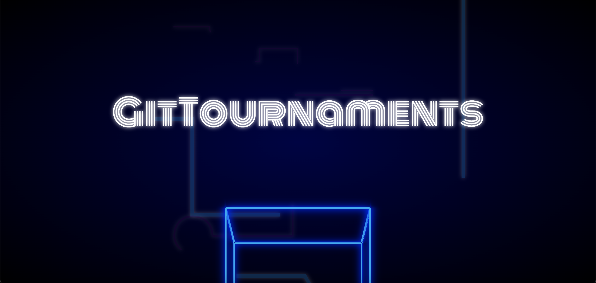
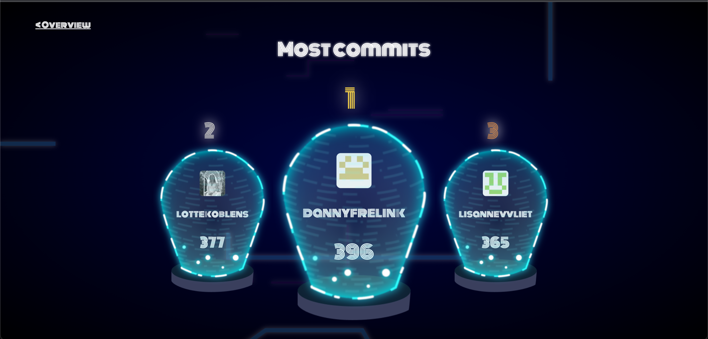

# Hackaton - Project 2

## App Interface




## Link naar de app
:globe_with_meridians: [Link naar live app](https://git-tournament.herokuapp.com/)

## Table of Contents
- [App interface](#app-interface)
- [Link naar de app](#link-naar-de-app)
- [Inhoudsopgave](#table-of-contents)
- [De Opdracht](#de-opdracht)
- [Doelen van het vak](#doelen-bij-dit-vak)
- [De app: GitTournement](#Gittournement)
- [De server aan krijgen](#hoe-krijg-je-de-server-aan)

## De Opdracht
In 4 te gekke dagen gaan wij uitvogelen hoe wij kunnen werken met de Github GraphQL API.

## Doelen bij dit vak
Na het afsluiten van dit vak kan je het volgende:
- _Een query van github genereren_
- _Weten hoe GraphQL API werkt_

## Gittournement
Voor onze app hebben wij gekozen om een leaderboard te laten zien op basis van de github forks van de minor. Via onze leaderboard kan je zien wie de meeste commits,
meeste stars en meeste repositories heeft.
Wij hebben er voor gekozen om een game-styling toe te passen aan onze app omdat wij een tournement willen creeeren voor de studenten aan de minor.
Door middel van onze app willen wij de studenten motiveren meerdere commits te doen of meerdere repositories te maken.

# Hoe krijg je de server aan
#### Installatie
om deze app te installeren heb je `NodeJS` en `NPM` nodig op jou apparat.

##### Hoe te installeren op jouw machine
Clone deze repo naar je pc met het volgende commando

```
git clone https://github.com/basv1996/GitTournement.git
```
Type in de command line het volgende om te downloaden

```
npm install
```
Dit zal alle packages die je nodig hebt voor deze applicatie installeren

#### Het starten van de server
De applicatie zou automatisch moeten starten, zo niet probeer dan het volgende

```bash
npm run start
```
De applicatie zal op poort 8000 runnen. Je gaat dus naar localhost:8000

## code uitleg
Door middel van een query gegenereerd door de github explorer kunnen we een call doen naar github om data op te halen. Met deze query halen wij de data op uit 
de repository van browser-technologies van dit studiejaar 2021-22. 
Hierbij vragen we per user die de repo geforkt heeft om diegene zijn of haar profielfoto, naam, porfiel url en het aantal repo's wat diegene heeft. 
Hiermee kunnen wij een leaderboard laten zien wie de 
```
        `query {
        repositoryOwner(login: "cmda-minor-web") {
          repository(name: "browser-technologies-2122") {
            forks(first: 100) {
              edges {
                node {
                  owner {
                    ... on User {
                      avatarUrl
                      login
                      name
                      url
                      repositories {
                        totalCount
                      }
                    }
                  }
                }
              }
            }
          }
        }
      }`
```